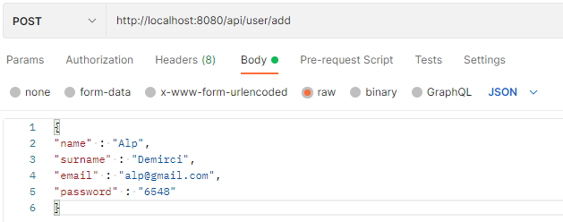
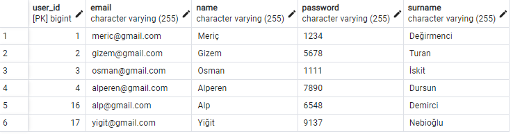
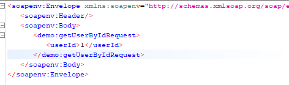

# Spring REST and SOAP Service Project

A Spring Boot REST and SOAP service project with layered architecture.
Bu Buğra Meriç Değirmenci

## Project Architecture


## User Entity

- long : userId
- string : name
- string : surname
- string : email
- string : password

## Rest API

- Get User by ID : `GET api/user/{userId}`
- Get User by Email : `GET api/user/email/{email}`
- Get Users by Name : `GET api/user/name/{name}`
- Get All Users : `GET api/user/all`
- Add User : `POST api/user/add`

## SOAP API

**WSDL** : `http://localhost:8080/ws/users.wsdl`

- Add User Request

```xml
<soapenv:Envelope xmlns:soapenv="http://schemas.xmlsoap.org/soap/envelope/" xmlns:demo="http://www.springbootrest.com/demo">
   <soapenv:Header/>
   <soapenv:Body>
      <demo:addUserRequest>
         <name>Meriç</name>
         <surname>Değirmenci</surname>
         <email>meric@gmail.com</email>
         <password>1234</password>
      </demo:addUserRequest>
   </soapenv:Body>
</soapenv:Envelope>
```

- Get All Users Request

```xml
<soapenv:Envelope xmlns:soapenv="http://schemas.xmlsoap.org/soap/envelope/" xmlns:demo="http://www.springbootrest.com/demo">
   <soapenv:Header/>
   <soapenv:Body>
      <demo:getAllUsersRequest></demo:getAllUsersRequest>
   </soapenv:Body>
</soapenv:Envelope>
```

- Get User by Id Request

```xml
<soapenv:Envelope xmlns:soapenv="http://schemas.xmlsoap.org/soap/envelope/" xmlns:demo="http://www.springbootrest.com/demo">
   <soapenv:Header/>
   <soapenv:Body>
      <demo:getUserByIdRequest>
         <userId>1</userId>
      </demo:getUserByIdRequest>
   </soapenv:Body>
</soapenv:Envelope>
```

- Get User by Name Request

```xml
<soapenv:Envelope xmlns:soapenv="http://schemas.xmlsoap.org/soap/envelope/" xmlns:demo="http://www.springbootrest.com/demo">
   <soapenv:Header/>
   <soapenv:Body>
      <demo:getUserByNameRequest>
         <name>Meriç</name>
      </demo:getUserByNameRequest>
   </soapenv:Body>
</soapenv:Envelope>
```

- Get User by Email Request

```xml
<soapenv:Envelope xmlns:soapenv="http://schemas.xmlsoap.org/soap/envelope/" xmlns:demo="http://www.springbootrest.com/demo">
   <soapenv:Header/>
   <soapenv:Body>
      <demo:getUserByEmailRequest>
         <email>meric@gmail.com</email>
      </demo:getUserByEmailRequest>
   </soapenv:Body>
</soapenv:Envelope>
```

## Project Testing

#### Initial Database Entities

##### User Table


#### REST API Tests

#### Add User

##### Request



##### Response


##### Change In Databse


#### Get User By ID

##### Request


##### Response


#### Get All Users

##### Request


##### Response


#### SOAP API Tests

#### Add User

##### Request


##### Response


##### Change In Databse



#### Get User By ID

##### Request



##### Response


#### Get All Users

##### Request


##### Response


